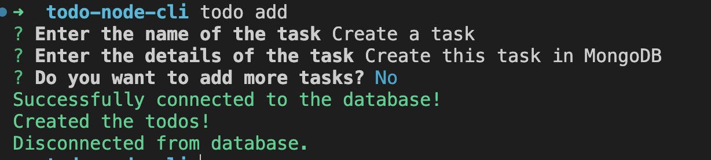
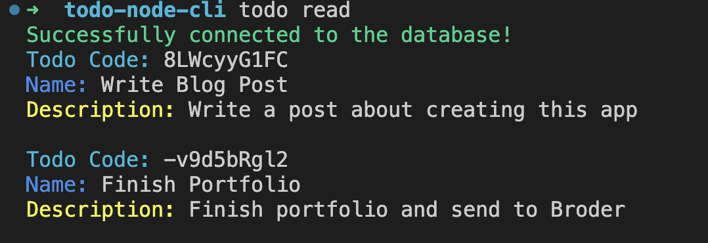
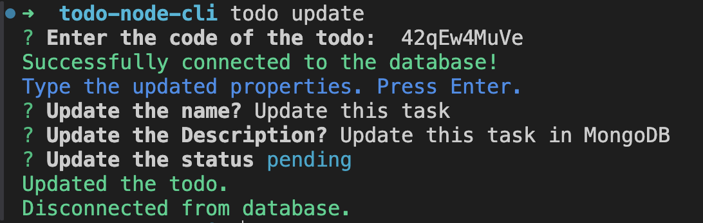
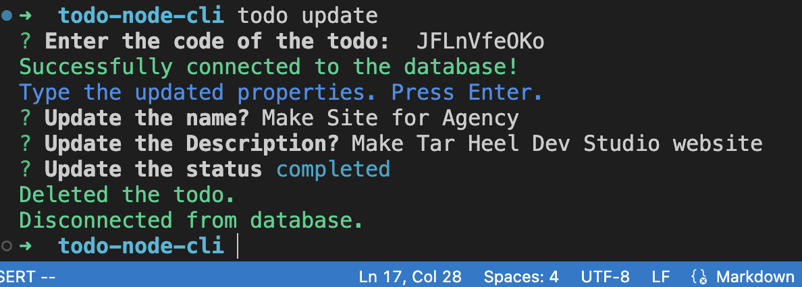
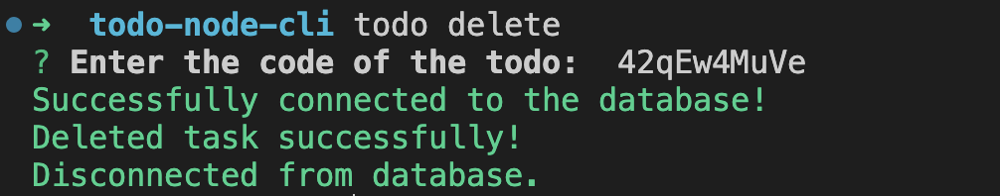

# To Do Node CLI App

This is a command line interface application that allows you to add, update, read, and delete tasks from the terminal. Tasks are stored in a MongoDB database. Chalk is used to add style to the text and Commander brings the whole application together. Mongoose is used for the schema and dotenv is used for environment variables. Inquirer is used to read the user input and ora is used to create the spinner in the terminal.

Here is what each command looks like:

## Create Todo

# Read Todo List

# Update Todo

- When the task is not completed:

- When a task is completed:

# Delete Todo

## Future Updates

Here are things I'd like to do with this project:

- [ ] Write a blog post
- [ ] Add table styling
